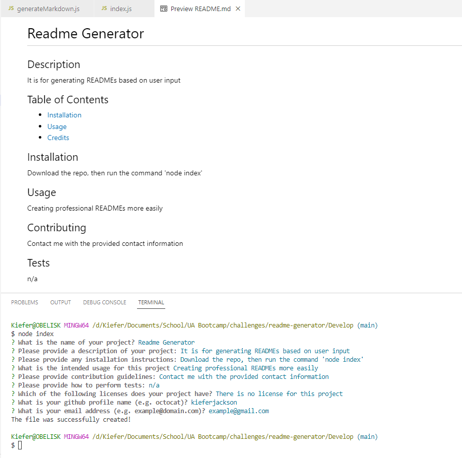

# README Generator

[How to create a Professional README](https://coding-boot-camp.github.io/full-stack/github/professional-readme-guide)

[Application Video Demonstration](https://drive.google.com/file/d/16M3PUkOU80T9xL9Sq88MO162tqKVStT-/view)

## Purpose
A well made README is an essential aspect of any programming project, yet it is all too often missing critical information or formatted poorly. The purpose of this project was to create a command-line application using Node.js to automatically generate a README file based on user input. In order to accomplish this, the Inquirer package was used to create prompts for the user to input information. This includes everything from licenses, contact information, and more.

## Design
The entire application revolves around the Inquirer package, and it simply displays questions which are contained within an array to the user, and saves their input. Once all of the questions have been answered, then a function is called to write the README file using the user's responses. A local package defined as 'generateMarkdown' contained all of the necessary logic to create an appropiate README file based on the user's input.

---

Here's a screenshot of the finished application:
